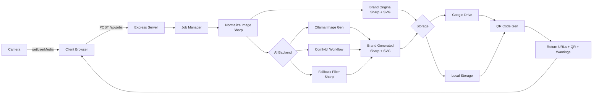

> **AI Generated Documentation**
>
> This documentation was generated by AI through static analysis of the project's source code. It represents the implementation at the time it was generated and may become outdated as the code evolves. Always treat the source code as the ultimate source of truth.

# Gibali ML Booth

A college photo booth application that captures a person's photo, transforms it into a Studio Ghibli-style anime portrait using AI (Ollama or ComfyUI), watermarks both the original and generated images with college branding, uploads them to Google Drive (or local storage), and generates QR code download links for students.

---

## Purpose

This project exists to power a physical college photo booth event. Students pose with a V hand sign in front of a camera, and the system produces a Ghibli-style anime version of their photo alongside the original. Both images are branded with the college logo and label, uploaded for distribution, and made accessible via QR codes and direct links.

**Intended audience:** College event organizers, student volunteers, and developers maintaining the booth infrastructure.

---

## Features

- **Camera capture** — Browser-based camera UI using `getUserMedia` with configurable resolution (1280x720).
- **Async job pipeline** — Image processing runs asynchronously with stage-level progress tracking (queued → normalizing → AI generation → branding → uploading → QR generation → done).
- **Dual AI backends** — Supports Ollama (for image-generation-capable models) and ComfyUI (with custom LoRA, checkpoint, sampler, and prompt templates).
- **Fallback image filter** — When no AI backend is available, a local stylized image filter (saturation boost, gamma, sharpen, median, blur) is applied using Sharp.
- **Vision-model prompt extraction** — Uses an Ollama vision model (e.g., `llava`) to analyze the photo and generate a descriptive prompt for the image generation backend.
- **College branding overlay** — Both original and generated images receive a branded strip at the bottom with configurable logo and label text.
- **Google Drive upload** — Images are uploaded to Google Drive via a service account. Files are optionally made publicly readable.
- **Local storage fallback** — If Drive credentials are missing or upload fails, images are saved to `server/local-storage/` and served via Express static middleware.
- **QR code generation** — QR codes pointing to each image's download URL are generated server-side using the `qrcode` library.
- **Job status polling** — The client polls the server for job progress (stage, percentage, ETA) and displays a real-time pipeline bar.
- **Upload progress tracking** — XHR upload progress events are displayed in the client pipeline with speed and ETA.
- **Health and status endpoints** — Server exposes health checks, Ollama status, ComfyUI status, and Drive status.

---

## Tech Stack

| Category | Technology |
|---|---|
| **Runtime** | Node.js (ES modules) |
| **Web framework** | Express 4 |
| **Image processing** | Sharp |
| **AI backend 1** | Ollama (HTTP API, vision + image generation models) |
| **AI backend 2** | ComfyUI (HTTP API, custom workflows) |
| **Cloud storage** | Google Drive API (`googleapis`, v3) |
| **QR generation** | `qrcode` |
| **File upload** | Multer (memory storage) |
| **CORS** | `cors` |
| **Environment** | `dotenv` |
| **Client** | Vanilla HTML/CSS/JS (no framework) |
| **Fonts** | Google Fonts (Outfit, Sora) |
| **Package manager** | npm |

---

## Project Structure

```
Gibali_ML/
├── LICENSE
├── README.md
├── .gitignore
├── client/                          # Static browser UI
│   ├── README.md
│   ├── index.html                   # Single-page camera booth UI
│   ├── app.js                       # Camera, upload, polling, rendering logic
│   ├── styles.css                   # All styles (no framework)
│   ├── run.bat                      # python -m http.server 5500
│   └── assets/
│       └── college-logo.svg         # SVG logo overlaid on output images
└── server/                          # Express API backend
    ├── README.md
    ├── package.json
    ├── package-lock.json
    ├── .env                         # Active configuration (git-ignored)
    ├── .env.example                 # Template for all config values
    ├── run.bat                      # npm start
    ├── secrets/
    │   └── service-account.json     # Google service account key (git-ignored)
    ├── local-storage/               # Fallback image storage (git-ignored)
    │   ├── original/
    │   └── generated/
    └── src/
        ├── index.js                 # Express app entry point, routes, job manager
        ├── config.js                # Environment variable parsing and exports
        └── services/
            ├── imageService.js      # Normalize, fallback stylize, brand stamping
            ├── ollamaService.js     # Ollama API client, model management, prompt building
            ├── comfyService.js      # ComfyUI API client, workflow builder, polling
            └── driveService.js      # Google Drive client, local storage fallback
```

---

## Architecture

### High-Level Design

The system follows a **client-server architecture** with a static frontend and an Express backend. The client captures a photo and sends it to the server, which processes it through a sequential pipeline and returns the results. Processing is available in both synchronous (`POST /api/convert`) and asynchronous job-based (`POST /api/jobs`) modes.



### Request Flow (Async Job)

1. Client captures photo from camera as a PNG blob.
2. Client uploads blob via `XMLHttpRequest` with progress tracking to `POST /api/jobs`.
3. Server validates the file (type, size) and creates an in-memory job record with a unique ID.
4. Server returns HTTP `202 Accepted` with the `jobId`.
5. Client begins polling `GET /api/jobs/:jobId` every second.
6. Server processes the job pipeline (see pipeline stages below).
7. When the pipeline finishes, the server marks the job as `completed` with result data.
8. Client receives the result and renders original image, generated image, QR codes, and download links.
9. Old job records are swept every 5 minutes (retention: 1 hour).

### Pipeline Stages

Each stage maps to a progress percentage and a human-readable label:

| Stage | Progress | Description |
|---|---|---|
| `queued` | 5% | Image queued for processing |
| `normalizing` | 18% | Auto-rotate and convert to PNG via Sharp |
| `ai_generate` | 56% | Vision model generates prompt → AI backend produces Ghibli image |
| `brand_original` | 66% | College branding strip overlaid on original |
| `upload_original` | 76% | Original branded image uploaded to Drive/local |
| `brand_generated` | 86% | College branding strip overlaid on generated image |
| `upload_generated` | 94% | Generated branded image uploaded to Drive/local |
| `qrcode` | 98% | QR codes generated for both download URLs |
| `done` | 100% | Job complete |

### Error Handling

- **Global error middleware** catches multer file-size errors (`413`) and unexpected exceptions (`500`).
- **Job-level errors** are stored in the job record with `status: "error"`, a human-readable message, an HTTP status code, and optional detail object.
- **AI generation failures** trigger the fallback stylize filter unless `REQUIRE_AI_GENERATION=true` (which returns `503`).
- **Drive upload failures** degrade gracefully to local storage without aborting the job.

---

## Core Components

### Express Server (`server/src/index.js`)

The application entry point. Responsibilities:
- Configures Express with CORS, JSON body parsing, static file serving for local storage (`/files`).
- Defines routes: `GET /`, `GET /api/health`, `GET /api/ollama/status`, `POST /api/convert`, `POST /api/jobs`, `GET /api/jobs/:jobId`.
- Maintains an in-memory `Map` of job records with automatic sweep cleanup.
- Orchestrates the full conversion pipeline via `runConversionPipeline`.
- Runs a preflight startup check for Ollama reachability and model availability.

### Config Module (`server/src/config.js`)

Parses environment variables with sensible defaults. All configuration is exported as a single `config` object with nested sections:
- `port`, `serverTimeoutMs`, `clientOrigin`, `publicBaseUrl`, `limits`
- `ollama` — base URL, vision model, image model, timeouts, auto-pull settings
- `generation` — `requireAi`, `imageBackend`
- `comfy` — enabled flag, base URL, checkpoint, LoRA, sampler parameters, prompts
- `googleDrive` — credentials path, folder IDs, public toggle
- `watermark` — logo path, label visibility

### Image Service (`server/src/services/imageService.js`)

Image manipulation layer built on Sharp:
- **`normalizeImage`** — Auto-rotates and converts input to PNG.
- **`fallbackStylize`** — Local non-AI stylization (saturation +45%, brightness +8%, hue shift, gamma, median, sharpen, blur) that approximates a Ghibli-like aesthetic.
- **`stampImageWithCollegeBrand`** — Draws a semi-transparent dark strip at the bottom of the image, overlays the label text, and positions the college logo SVG on the left.
- **`createGhibliImage`** — The AI orchestration function: calls vision model for prompt, iterates through configured backends (Ollama → ComfyUI), and falls back to `fallbackStylize` if all backends fail or are unconfigured. Returns `{ imageBuffer, prompt, source }` where `source` identifies which path produced the output.

### Ollama Service (`server/src/services/ollamaService.js`)

HTTP client for the Ollama API:
- **`buildGhibliPromptFromImage`** — Sends the captured image to an Ollama vision model (e.g., `llava`) via `/api/chat` and extracts a descriptive prompt. Falls back to a default prompt if the vision model is unavailable.
- **`generateImageWithOllama`** — Sends the input image + Ghibli prompt to an Ollama image-generation model via `/api/generate`. Supports models that return base64 images in the response.
- **`ensureOllamaAndModelsReady`** — Startup verification: checks reachability, lists installed models, auto-pulls missing required/optional models if configured. Tracks missing models in a shared `knownMissingModels` Set to avoid repeated failures.
- **`getOllamaStartupStatus`** — Returns current status object (reachable, installed models, missing models, pulled models, error).

### ComfyUI Service (`server/src/services/comfyService.js`)

HTTP client for ComfyUI's API:
- **`generateImageWithComfy`** — Uploads input image to ComfyUI, builds a workflow JSON (checkpoint loader, VAE encode, CLIP text encode, optional LoRA loader, KSampler, VAE decode, SaveImage), queues the prompt, polls `/history` for completion, fetches the output image bytes.
- **`buildWorkflow`** — Constructs the ComfyUI prompt workflow with configurable parameters: checkpoint, sampler, scheduler, steps, CFG scale, denoise, positive/negative prompt templates, optional LoRA.
- **`getComfyStatus`** — Returns `{ enabled, baseUrl, checkpoint, configured }`.

### Drive Service (`server/src/services/driveService.js`)

Storage abstraction with automatic fallback:
- **`uploadImage`** — Attempts Google Drive upload first; falls back to local disk on failure or missing configuration.
- **`uploadToDrive`** — Authenticates via service account (`google.auth.GoogleAuth`), creates a file with `drive.files.create`, optionally makes it public via `drive.permissions.create`, returns view/download/preview URLs.
- **`uploadToLocal`** — Writes file to `local-storage/{kind}/` and returns a URL served by the Express static middleware.
- **`getDriveStatus`** — Returns configuration status (configured folders, credentials, disabled reason).
- Drive client is lazily initialized once; failed uploads reset the client to trigger re-authentication on the next attempt.

### Client (`client/`)

Static single-page application:
- **Camera** — Uses `getUserMedia` with 1280x720 preferred resolution, facing user. Captures frames to a canvas and converts to PNG blob.
- **Upload** — Uses `XMLHttpRequest` with `upload.onprogress` events for accurate upload speed and ETA display.
- **Polling** — Polls `GET /api/jobs/:jobId` every second, updating a pipeline progress bar and stage label.
- **Result display** — Renders both original and generated images, QR code images (rendered as `` from data URLs), and clickable view/download links.
- **Config** — API base URL configured via `window.APP_CONFIG.apiBaseUrl` in `index.html`.

---

## APIs

### Server Endpoints

| Method | Path | Purpose | Auth | Request | Response |
|---|---|---|---|---|---|
| `GET` | `/` | Root info | None | — | `{ ok, message, endpoints }` |
| `GET` | `/api/health` | Health + backend status | None | — | `{ ok, status, ollama, comfy, drive, ... }` |
| `GET` | `/api/ollama/status` | Ollama status detail | None | — | `{ ok, ollama: { reachable, installedModels, ... } }` |
| `POST` | `/api/convert` | Synchronous image conversion | None | `multipart/form-data` field `image` | `{ ok, original, generated, ... }` |
| `POST` | `/api/jobs` | Async job creation | None | `multipart/form-data` field `image` | `{ ok, jobId, statusUrl }` (202) |
| `GET` | `/api/jobs/:jobId` | Job status + result | None | — | `{ ok, job: { id, status, stage, progress, result, ... } }` |

### External APIs

- **Ollama API** (`http://<OLLAMA_BASE_URL>:11434`)
  - Used by `ollamaService.js` for `/api/chat`, `/api/generate`, `/api/tags`, `/api/pull`.
  - No authentication required (local service).
  - Request/response: JSON, with base64 image data for vision/image models.

- **ComfyUI API** (`http://<COMFYUI_BASE_URL>:8188`)
  - Used by `comfyService.js` for `/upload/image`, `/prompt`, `/history/{id}`, `/view`.
  - No authentication required (local service).
  - Workflow built as JSON; output images fetched as binary buffers.

- **Google Drive API** (v3)
  - Used by `driveService.js` for `files.create`, `permissions.create`, `files.get`.
  - Authentication via service account JSON key with scope `https://www.googleapis.com/auth/drive.file`.

### Error Responses

All endpoints return JSON with `{ ok: false, error: "message" }` on failure. The `POST /api/convert` endpoint may include additional `details` on `503` errors. Multer file-size violations return `413` with the max allowed size.

---

## Environment Variables

All variables are defined in `server/.env.example`. Below is a categorized summary. Actual values must never be committed.

| Variable | Default | Purpose |
|---|---|---|
| `PORT` | `8787` | Server listen port |
| `CLIENT_ORIGIN` | `*` | Allowed CORS origin(s), comma-separated |
| `PUBLIC_BASE_URL` | `http://localhost:8787` | Public-facing base URL for local file links |
| `MAX_UPLOAD_MB` | `10` | Maximum allowed image upload size |
| `SERVER_TIMEOUT_MS` | `120000` | Express server timeout |
| `OLLAMA_BASE_URL` | `http://127.0.0.1:11434` | Ollama server URL |
| `OLLAMA_VISION_MODEL` | `llava:13b` | Ollama vision model for prompt extraction |
| `OLLAMA_IMAGE_MODEL` | `""` | Ollama model capable of image generation (empty = disabled) |
| `OLLAMA_TIMEOUT_MS` | `90000` | Ollama request timeout |
| `OLLAMA_STARTUP_CHECK` | `true` | Enable/disable startup model check |
| `OLLAMA_AUTO_PULL` | `true` | Auto-pull missing required models at startup |
| `OLLAMA_PULL_OPTIONAL_MODELS` | `false` | Also pull optional (vision) models at startup |
| `REQUIRE_AI_GENERATION` | `false` | Reject requests if AI generation is unavailable |
| `IMAGE_BACKEND` | `auto` | Backend selection: `auto`, `ollama`, `comfy`, `fallback` |
| `COMFYUI_ENABLED` | `true` | Enable/disable ComfyUI backend |
| `COMFYUI_BASE_URL` | `http://127.0.0.1:8188` | ComfyUI server URL |
| `COMFYUI_CHECKPOINT` | `""` | ComfyUI checkpoint filename (required for generation) |
| `COMFYUI_TIMEOUT_MS` | `240000` | ComfyUI request timeout |
| `COMFYUI_POLL_INTERVAL_MS` | `1200` | Poll interval for completion check |
| `COMFYUI_STEPS` | `20` | Sampling steps |
| `COMFYUI_CFG` | `6.5` | CFG scale |
| `COMFYUI_DENOISE` | `0.35` | Denoise strength (img2img) |
| `COMFYUI_SAMPLER` | `euler` | Sampler name |
| `COMFYUI_SCHEDULER` | `normal` | Scheduler name |
| `COMFYUI_LORA` | `""` | LoRA model filename (optional) |
| `COMFYUI_LORA_STRENGTH` | `0.8` | LoRA model and CLIP strength |
| `COMFYUI_PROMPT_TEMPLATE` | (see `.env.example`) | Prompt template with `{prompt}` placeholder |
| `COMFYUI_NEGATIVE_PROMPT` | (see `.env.example`) | Negative prompt for undesired features |
| `GOOGLE_APPLICATION_CREDENTIALS` | `./secrets/service-account.json` | Path to service account JSON |
| `GOOGLE_DRIVE_ORIGINAL_FOLDER_ID` | `""` | Drive folder ID for original images |
| `GOOGLE_DRIVE_GENERATED_FOLDER_ID` | `""` | Drive folder ID for generated images |
| `GOOGLE_DRIVE_MAKE_PUBLIC` | `true` | Make uploaded files publicly readable |
| `COLLEGE_LOGO_PATH` | `../client/assets/college-logo.svg` | Path to college logo SVG |
| `WATERMARK_SHOW_LABEL` | `true` | Show/hide the branded strip on output images |

---

## Database

Not applicable. The project uses no database. Job state is held in an in-memory `Map` with a periodic sweep and does not persist across restarts.

---

## Configuration

### `server/package.json`

- Named `gibali-ml-server`, version `0.1.0`, private.
- ES modules (`"type": "module"`).
- Scripts: `dev` (node --watch), `start` (node).
- Dependencies: `cors`, `dotenv`, `express`, `googleapis`, `multer`, `qrcode`, `sharp`.

### `server/.env.example` / `server/.env`

All runtime configuration is via environment variables (see Environment Variables section above). `.env.example` serves as documentation and template; `.env` is the active configuration and is git-ignored.

### `.gitignore`

Ignores `server/node_modules/`, `server/.env`, `server/secrets/`, `server/local-storage/`, logs, and OS metadata files.

### `client/run.bat` / `server/run.bat`

Convenience launchers: `client/run.bat` runs `python -m http.server 5500`, `server/run.bat` runs `npm start`.

---

## Dependencies

### Runtime Dependencies (server)

| Package | Purpose |
|---|---|
| `express` | HTTP server and routing framework |
| `cors` | Cross-Origin Resource Sharing middleware |
| `multer` | Multipart file upload parsing (memory storage) |
| `sharp` | High-performance image processing (rotate, resize, composite, filter) |
| `googleapis` | Google Drive API client |
| `qrcode` | QR code generation (to data URL) |
| `dotenv` | `.env` file loading |

### Client Dependencies

None. The client is pure HTML, CSS, and JavaScript loaded from CDN fonts only (Google Fonts: Outfit, Sora).

### Internal Dependencies

```
index.js
  ├── config.js              (no dependencies)
  ├── imageService.js
  │     ├── config.js
  │     ├── ollamaService.js
  │     └── comfyService.js
  ├── ollamaService.js
  │     └── config.js
  ├── comfyService.js
  │     └── config.js
  └── driveService.js
        ├── config.js
        └── googleapis
```

---

## Installation

### Prerequisites

- Node.js 18+ (ES modules support)
- npm
- (Optional) Ollama server running on the host
- (Optional) ComfyUI server running on the host
- (Optional) Google Cloud project with Drive API enabled and a service account key

### Server Setup

```bash
cd server
npm install
cp .env.example .env
# Edit .env with your configuration
```

### Client Setup

No build step required. The client is served by any static HTTP server.

---

## Running

### Development (server)

```bash
cd server
npm run dev
```

Uses Node's built-in `--watch` flag for auto-restart on file changes.

### Production (server)

```bash
cd server
npm start
```

### Client

```bash
cd client
python -m http.server 5500
```

Then open `http://localhost:5500`.

Alternatively, use any static server (npx serve, http-server, etc.).

### End-to-End Test

1. Start ComfyUI (if using ComfyUI backend).
2. Start Ollama (if using Ollama backend).
3. Start the server.
4. Start the client.
5. Open the client URL, click "Start Camera", capture a photo, and click "Send to Booth".

---

## How It Works

1. **Student approaches the booth** and shows a V hand sign.
2. **Operator clicks "Capture"** in the browser. The client captures the camera frame as a PNG using Canvas `toBlob`.
3. **Operator clicks "Send to Booth"**. The client uploads the PNG to the server via `POST /api/jobs` with a multipart form. An upload progress bar shows the transfer speed and ETA.
4. **Server receives the file**, validates it (type, size), creates an in-memory job record with a unique ID, and returns `202 Accepted` with the `jobId`.
5. **Server begins the pipeline**:
   - Normalizes the image (auto-rotation, PNG conversion).
   - Sends the image to the Ollama vision model for Ghibli-style prompt generation (or uses a default prompt).
   - Attempts AI generation through the configured backend(s): Ollama image model → ComfyUI.
   - If all AI backends fail or are disabled, applies a local stylized filter (saturation, gamma, sharpen, blur).
   - Brands the original image with the college logo and label.
   - Uploads the branded original to Google Drive (or local storage).
   - Brands the generated image the same way.
   - Uploads the branded generated image.
   - Generates QR code data URLs for both download links.
6. **Client polls** `GET /api/jobs/:jobId` every second, updating a pipeline progress bar and stage label mapped from the server's stage value.
7. **When the job completes**, the client displays both images side by side, each with its QR code and Open/Download links. The server info panel shows metadata: job ID, generation mode, processing source, storage backend, prompt used, timings, and any warnings (e.g., fallback active, Drive disabled).
8. **Student scans the QR code** with their phone to download their Ghibli-style portrait and the original.
9. **Old jobs are automatically cleaned up** from memory after 1 hour (sweep runs every 5 minutes).

---

## License

This project is licensed under a proprietary license. See the [LICENSE](./LICENSE) file for details.
